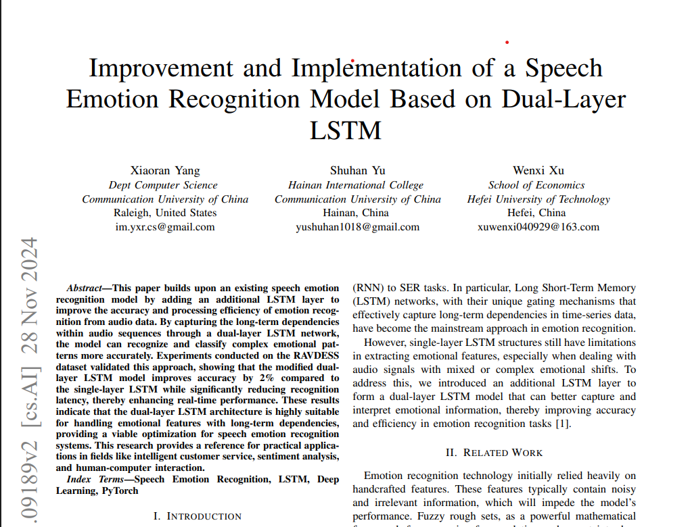

# 🎤 Speech Emotion Recognition using Dual-Layer LSTM  
### Implementation of the Paper  
**"Improvement and Implementation of a Speech Emotion Recognition Model Based on Dual-Layer LSTM"**

---

## 📄 Research Paper
We are implementing the model described in the research paper:

> **Improvement and Implementation of a Speech Emotion Recognition Model Based on Dual-Layer LSTM**

Below is the original paper preview used in this project:

(*paper.png is the above image — add it to the repo root folder*)

---

## 🚀 Project Overview  
This repository contains a **from-scratch implementation** of a Speech Emotion Recognition (SER) system using **Dual-Layer LSTM**, inspired by the architecture proposed in the above research paper.

We do **not** use any prebuilt models — the entire model (feature extraction → architecture → training pipeline) is built manually.

### 🔍 What We Implement
✔ Dual-Layer LSTM network  
✔ Full audio-preprocessing pipeline (MFCC, Chroma, Mel-Spectrogram, Tonnetz, Contrast)  
✔ Proper padding + sequence alignment  
✔ Scaler + label encoder integration  
✔ Training, evaluation, inference pipeline  
✔ Streamlit App for real-time emotion prediction  

---

## 🧠 Paper Summary (In Simple Terms)
The paper improves traditional SER models by:

- Adding an **extra LSTM layer** to capture deeper long-term dependencies  
- Improving recognition accuracy by learning emotional patterns more strongly  
- Achieving ~2% better accuracy on the RAVDESS dataset  
- Providing better **real-time performance** and **lower latency**

Dual-Layer LSTM helps the model understand:

- Tone  
- Pitch  
- Frequency variation  
- Temporal emotion flow  
- Complex emotional transitions  

This is more effective than a single-layer LSTM when the speech has mixed or subtle emotions.

---

## 🎧 Dataset Used – **RAVDESS**
We use the **RAVDESS (Ryerson Audio-Visual Database of Emotional Speech and Song)** dataset.

### 🎭 Emotions Included:
- Angry  
- Disgust  
- Fearful  
- Happy  
- Neutral  
- Sad  
- Surprised  
- Calm  

### 🎙 Audio Quality
- 24 professional actors  
- Studio-level audio recordings  
- Balanced emotional classes  

This makes RAVDESS a great benchmark dataset for emotion recognition projects.

---

## 🏗 Tech Stack
- **Python**
- **TensorFlow / Keras**
- **Librosa**
- **NumPy**
- **Joblib**
- **Plotly**
- **Streamlit**

---

## 📁 Project Structure
