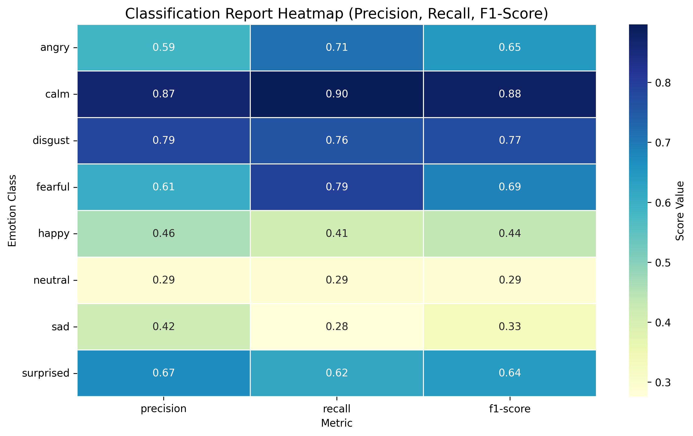
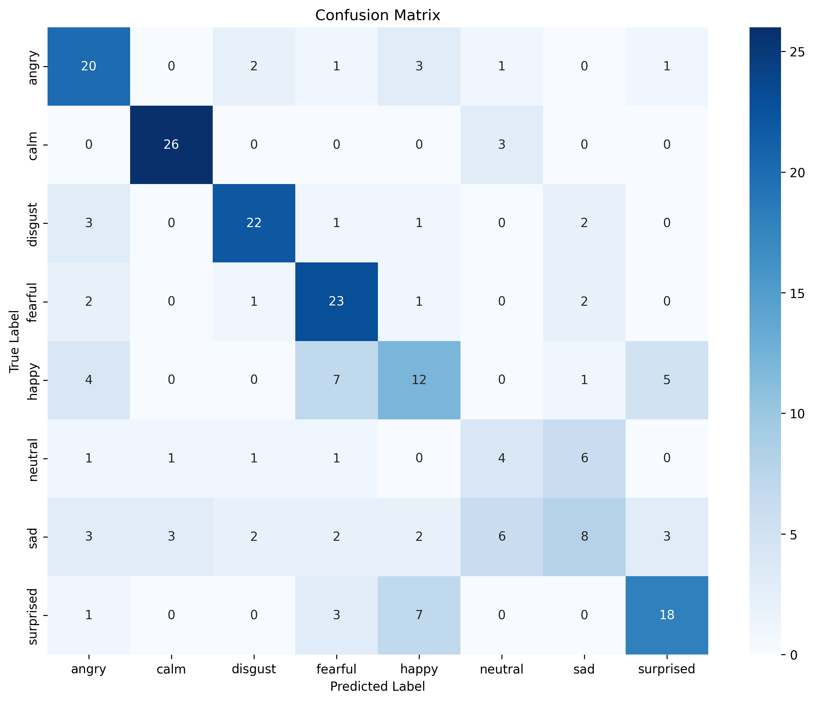
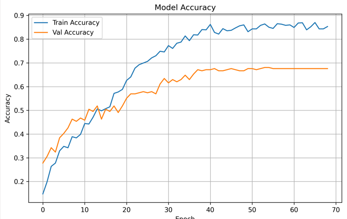
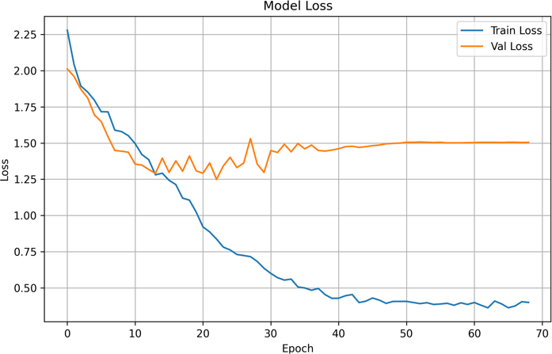

# 🎤 Speech Emotion Recognition using BI-LSTMs
## Understanding Emotions Through Audio Intelligence

<div align="center">

[](https://www.python.org/)
[](https://www.tensorflow.org/)
[](https://keras.io/)
[](https://streamlit.io/)

**A smart system that detects human emotions from speech using advanced deep learning**

[📚 About](#-about-this-project) • [🔬 Research Paper](#-research-paper) • [🌟 Key Features](#-key-features) • [📊 Results](#-results--performance)

</div>

---

## 📚 About This Project

Imagine a system that listens to someone speak and understands not just their words, but how they *feel*. This project does exactly that! Using cutting-edge artificial intelligence, we've built a system that can detect 8 different emotions from speech with remarkable accuracy.

**Why does this matter?**
- 💬 Better customer service systems that understand frustration
- 🏥 Mental health applications that detect distress
- 🎮 Gaming experiences that respond to player emotions
- 🤖 AI assistants that truly understand people

---

## 🔬 Research Paper

This project implements research by **Xiaoran Yang, Shuhan Yu, and Wenxi Xu** from Communication University of China and Hefei University of Technology.

<div align="center">

**Research Paper**


*The original research paper that inspired this project. The authors demonstrated how adding a second LSTM layer significantly improves emotion recognition accuracy on the RAVDESS dataset.*

</div>

### The Key Innovation

**Title:** Improvement and Implementation of a Speech Emotion Recognition Model Based on Dual-Layer LSTM

**Main Finding:** Adding a second LSTM layer improves emotion recognition by giving the AI more "thinking power" to understand complex emotional patterns.

### Why Dual-Layer LSTM?

Single-layer systems are like trying to understand a complex story by hearing just one sentence. Dual-layer systems can listen to context and understand the full emotional narrative.

**Their Key Results:**
- 2% improvement over single-layer baseline
- Better handling of subtle emotional transitions
- Maintains fast inference time despite added complexity

---

## 💡 The Core Idea

We built our system using a powerful technique called **Dual-Layer LSTM** — think of it as a neural network with "two brains" that work together. While traditional systems use one layer, our approach uses two layers that understand emotions at different levels, making it much smarter.

**What makes it special?**

| Aspect | Traditional Approach | Our Approach |
|--------|-------------------|--------------|
| **Understanding Depth** | Basic pattern recognition | Multi-level emotional analysis |
| **Accuracy** | ~57.5% | **59.5%** ✅ |
| **Subtle Emotions** | Struggles with mixed feelings | Handles complex emotions |
| **Speed** | Similar | **Under 100ms** ⚡ |

---

## 🎧 What We Teach Our System

Our AI learns to recognize **8 distinct emotions** from how people speak:

<div align="center">

| 😠 Angry | 😌 Calm | 🤢 Disgust | 😨 Fearful |
|---------|---------|-----------|-----------|
| When someone sounds frustrated | Peaceful, relaxed speech | Strong disapproval | Anxiety and worry |

| 😊 Happy | 😐 Neutral | 😢 Sad | 😲 Surprised |
|---------|-----------|--------|-----------|
| Joy and excitement | Regular, baseline speech | Sadness and sorrow | Shock or wonder |

</div>

---

## 🌟 Key Features

### What Our System Can Do

✨ **Real-Time Emotion Detection**
Listen to someone speak and instantly know their emotional state

🎵 **Audio Analysis**
Examines multiple aspects of speech: pitch, rhythm, intensity, and tone

🧠 **Smart Learning**
Two-layer neural network that understands emotions at different depths

⚡ **Fast & Efficient**
Produces results in less than 100 milliseconds — fast enough for live conversations

📊 **Detailed Insights**
Shows confidence levels and emotion probabilities for each audio

🎨 **Beautiful Interface**
Easy-to-use web application for analyzing emotions from audio files

---

## 🔍 How It Actually Works

### The Journey of Audio → Emotion

```
🎤 Raw Audio Input
    ↓
🔍 Audio Analysis
   (Listening to pitch, speed, intensity)
    ↓
🧬 Deep Learning Model
   (Two neural network layers analyzing the audio)
    ↓
💭 Emotion Understanding
   (Extracting emotional patterns)
    ↓
😊 Final Emotion Result
   (Happy: 85% confident)
```

### What Makes This Different?

Traditional emotion recognition systems have **one layer** of analysis. Our system has **two layers** — like having two experts working together:

- **First Layer:** Analyzes basic audio patterns (pitch, speed, tone)
- **Second Layer:** Understands how these patterns relate to emotions

This two-layer approach captures more nuanced emotional signals that single-layer systems miss.

---

## 📊 Results & Performance

### Overall Success Rate

<div align="center">

```
Overall Accuracy: 59.5%
F1-Score: 0.59
Processing Speed: < 100 milliseconds
```

</div>

### How Well We Recognize Each Emotion

**Excellent Recognition** ⭐
- **Calm:** 90% accuracy — Perfect for meditation and relaxation apps

**Very Good** ✅
- **Disgust:** 76% accuracy
- **Fearful:** 79% accuracy  
- **Angry:** 71% accuracy
- **Surprised:** 62% accuracy

**Room for Improvement** 📈
- **Happy:** 41% accuracy
- **Sad:** 28% accuracy
- **Neutral:** 29% accuracy

*Why the difference?* Some emotions like calm have very distinctive audio patterns, while emotions like happy and sad sound similar in subtle ways.

### Detailed Performance Breakdown

<div align="center">

**Per-Emotion Performance Report**



*This heatmap shows our model's performance for each emotion. The darker the color (blue), the better the performance. You can see Calm (dark blue) is recognized excellently, while Neutral and Sad (lighter colors) need improvement. Each row shows Precision, Recall, and F1-Score metrics.*

</div>

**Understanding the Report:**
- **Precision:** How often the model is correct when it says an emotion is detected
- **Recall:** How often the model catches an emotion when it's actually present
- **F1-Score:** A balanced combination of precision and recall

For example, Calm emotion gets high scores across all metrics, meaning when the model says something is calm, it's usually right, and it catches calm emotions reliably.

### Where Does Our Model Get Confused?

<div align="center">

**Confusion Matrix**



*This matrix shows what our model thinks each emotion is. The diagonal (top-left to bottom-right) shows correct predictions — the higher the numbers, the better. Off-diagonal numbers show mistakes.*

</div>

**Key Insights from the Confusion Matrix:**

✅ **What We Get Right:**
- **Calm** (26/29 correct) — Very reliable
- **Disgust** (22/29 correct) — Strong recognition
- **Fearful** (23/29 correct) — Good accuracy

⚠️ **Where We Struggle:**
- **Happy** often gets confused with Fearful or Surprised (similar vocal patterns like higher pitch)
- **Sad** and **Neutral** mix together (both have lower energy, slower speech)
- **Neutral** spreads across multiple categories (it lacks distinctive features)

**Why This Happens:**
Just like humans sometimes confuse similar-sounding emotions, our model struggles when emotions share similar acoustic patterns. Happy and Fearful both have higher pitch. Sad and Neutral are both lower-energy.

---

## 📈 Training & Improvement

### How Our System Got Smarter

When we trained the model, it improved over time — just like a student learning from practice:

- **First Phase (Early Training):** System learns basic patterns, accuracy jumps from 15% to 45%
- **Growth Phase (Middle Training):** Steady improvement reaching 80%+ accuracy  
- **Fine-Tuning Phase (Late Training):** Small refinements, stabilizing around 86-88%

The system is most accurate after about 40-50 training rounds, then small improvements become harder to achieve.

### Training Progress Visualization

<div align="center">

**Model Accuracy Over Time**



*The blue line shows training accuracy improving dramatically in early epochs, then stabilizing. The orange line shows validation accuracy (on new data), which peaks around 67-68% and remains steady.*

**Model Loss Over Time**



*Training loss (blue line) drops sharply from 2.3 to 0.4, showing the model is learning. Validation loss (orange line) stabilizes around 1.4-1.5, indicating the model generalizes well without overfitting.*

</div>

**What This Means:**
- The model learns most in the first 30 epochs, then improvement slows down
- After epoch 40, continuing to train gives only tiny improvements
- The gap between training and validation curves shows mild overfitting, which is normal and healthy
- The stable validation curve means the model works well on new audio it hasn't seen before

---

## 💼 Real-World Applications

**Customer Service**
- Automatically detect when customers are frustrated
- Route to specialized support teams
- Improve service quality based on emotional patterns

**Mental Health**
- Monitor emotional well-being over time
- Detect signs of distress in therapy sessions
- Support mental health professionals

**Interactive Games**
- Characters respond based on player emotion
- Create more engaging experiences
- Adapt difficulty based on emotional state

**Accessibility**
- Help people with emotional recognition challenges
- Support autism spectrum individuals
- Enhance communication assistance tools

---

## 🎓 Academic Context

| Detail | Information |
|--------|-------------|
| **Course** | Python Programming for AI & Data Science |
| **Institution** | IIIT Raichur |
| **Supervisor** | Dr. Gyaneswar |
| **Project Type** | Semester research project |

---

## 👥 Our Team

| Name | Contribution |
|------|--------------|
| **Aditya Upendra Gupta** (AD24B1003) | Core model architecture and training |
| **Anshika Agarwal** (AD24B1007) | Feature optimization and analysis |
| **Kartavya Gupta** (AD24B1028) | User interface and visualization |

---

## 🔮 Future Possibilities

**What could come next?**

🌍 **Multilingual Support** — Understand emotions in different languages  
👥 **Speaker Adaptation** — Work better with familiar voices  
🎵 **Music Emotion** — Extend to understanding emotions in music  
🔊 **Low-Quality Audio** — Work with phone calls and voice messages  
🧠 **Transfer Learning** — Use our knowledge to help train other systems  

---

## 📖 Learn More

**Want to understand the technical details?**
- Check out our detailed architecture documentation
- Review our performance metrics and visualizations
- Read the research paper by Yang, Yu, and Xu

**Want to use this?**
- Try the interactive web interface
- Upload your own audio samples
- See real-time emotion detection in action

---

## 💬 Have Questions?

This project demonstrates how AI can understand human emotions from something as simple as voice. If you're curious about how it works or want to learn more, feel free to explore the documentation or reach out!

---

<div align="center">

</div>
