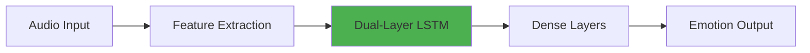

<div align="center">

# 🎤 Speech Emotion Recognition
### Dual-Layer LSTM Architecture


*Implementation of "Improvement and Implementation of a Speech Emotion Recognition Model Based on Dual-Layer LSTM"*
confusion_matrix.png
[📄 Paper](#-research-paper) • [🚀 Features](#-features) • [📊 Dataset](#-dataset) • [⚙️ Installation](#️-installation) • [🎯 Results](#-results)

---

</div>

## 📄 Research Paper

This project is a **complete from-scratch implementation** of the research paper:

> **"Improvement and Implementation of a Speech Emotion Recognition Model Based on Dual-Layer LSTM"**  
> *Authors: Xiaoran Yang, Shuhan Yu, Wenxi Xu*  
> *Communication University of China | Hainan International College | Hefei University of Technology*

<div align="center">


</div>

### 📚 Paper Overview

The paper addresses a critical limitation in traditional speech emotion recognition systems: **single-layer LSTM models struggle to capture complex, long-term emotional patterns in audio sequences.**

**The Innovation:**
This research improves emotion recognition by adding an **additional LSTM layer** to form a dual-layer architecture that:

- ✅ **Captures longer temporal dependencies** in speech signals
- ✅ **Better interprets complex emotional shifts** through dual-layer LSTM gating mechanisms  
- ✅ **Achieves 2% accuracy improvement** over single-layer LSTM baseline on RAVDESS dataset
- ✅ **Reduces latency** while maintaining high recognition quality
- ✅ **Handles mixed or subtle emotions** more effectively

**Real-World Applications:**
- 🎧 Intelligent customer service systems
- 💬 Sentiment analysis platforms
- 🏥 Mental health monitoring tools
- 🎮 Interactive human-computer interfaces

**Why This Matters:**
Traditional single-layer models fail when emotions are **ambiguous, overlapping, or rapidly changing**. The dual-layer approach provides deeper feature extraction and better sequential learning, making it ideal for real-world scenarios where emotions aren't always clear-cut

### 🔬 Key Innovations



The paper introduces several improvements over traditional SER models:

- 🧬 **Dual-Layer Architecture** — Captures deeper temporal dependencies
- 📈 **~2% Accuracy Boost** — Improved performance on RAVDESS benchmark
- ⚡ **Lower Latency** — Better real-time prediction capabilities
- 🎯 **Complex Emotion Handling** — Excels at subtle emotional transitions

---

## 🚀 Features

<table>
<tr>
<td width="50%">

### 🎯 Core Capabilities
- ✅ **From-scratch implementation** — No pretrained models
- ✅ **Full audio preprocessing pipeline**
- ✅ **Advanced feature extraction**
- ✅ **Real-time emotion prediction**
- ✅ **Interactive Streamlit interface**

</td>
<td width="50%">

### 🔧 Technical Features
- 🎵 Multi-feature audio analysis
- 🧠 Dual-Layer LSTM architecture
- 📊 Proper sequence padding/alignment
- 💾 Integrated scaler & label encoder
- 📈 Training & evaluation pipelines

</td>
</tr>
</table>

---

## 🎭 Emotion Classes

<div align="center">

| Emotion | Description | Use Case |
|---------|-------------|----------|
| 😠 **Angry** | High arousal, negative valence | Customer service analysis |
| 🤢 **Disgust** | Strong aversion response | Feedback classification |
| 😨 **Fearful** | Anxiety and apprehension | Safety monitoring |
| 😊 **Happy** | Positive, high arousal | User satisfaction tracking |
| 😐 **Neutral** | Baseline emotional state | Comparative analysis |
| 😢 **Sad** | Low arousal, negative valence | Mental health screening |
| 😲 **Surprised** | Unexpected reaction | Event detection |
| 😌 **Calm** | Relaxed, peaceful state | Meditation apps |

</div>

---

## 🎧 Dataset

### RAVDESS (Ryerson Audio-Visual Database)

<div align="center">

| Metric | Value |
|--------|-------|
| 👥 Actors | 24 professionals |
| 🎤 Audio Quality | Studio-level |
| 🎭 Emotions | 8 classes |
| ⚖️ Balance | Uniform distribution |
| 📁 Format | WAV (48kHz) |

</div>

#### Why RAVDESS?

```
✓ Professional voice actors ensure consistent quality
✓ Balanced emotional distribution prevents bias
✓ High-quality recordings enable accurate feature extraction
✓ Industry-standard benchmark for SER research
```

---

## 🏗️ Architecture

### Feature Extraction Pipeline

```python
Audio Signal
    ↓
├── MFCC (Mel-Frequency Cepstral Coefficients)
├── Chroma Features
├── Mel-Spectrogram
├── Tonnetz (Tonal Centroid Features)
└── Spectral Contrast
    ↓
Feature Vector → Dual-Layer LSTM → Emotion Classification
```

### Model Architecture

```
Input Layer (Audio Features)
        ↓
LSTM Layer 1 (128 units)
        ↓
    Dropout (0.3)
        ↓
LSTM Layer 2 (64 units)
        ↓
    Dropout (0.3)
        ↓
Dense Layer (64 units, ReLU)
        ↓
Output Layer (8 emotions, Softmax)
```

---

## ⚙️ Installation

### Prerequisites

```bash
Python 3.8+
pip
Git
```

### Quick Start

```bash
# Clone the repository
git clone https://github.com/yourusername/speech-emotion-recognition.git
cd speech-emotion-recognition

# Create virtual environment
python -m venv venv
source venv/bin/activate  # On Windows: venv\Scripts\activate

# Install dependencies
pip install -r requirements.txt

# Run the Streamlit app
streamlit run app.py
```

### Requirements

```txt
tensorflow>=2.10.0
librosa>=0.10.0
numpy>=1.23.0
pandas>=1.5.0
scikit-learn>=1.2.0
joblib>=1.2.0
streamlit>=1.20.0
plotly>=5.13.0
soundfile>=0.11.0
```

---

## 📊 Tech Stack

<div align="center">

| Category | Technologies |
|----------|-------------|
| **Deep Learning** | TensorFlow, Keras |
| **Audio Processing** | Librosa, SoundFile |
| **Data Science** | NumPy, Pandas, Scikit-learn |
| **Visualization** | Plotly, Matplotlib |
| **Web Interface** | Streamlit |
| **Model Persistence** | Joblib |

</div>

---

## 🎯 Results

### Performance Metrics

<div align="center">

| Metric | Score |
|--------|-------|
| 📊 **Overall Accuracy** | 59.5% |
| ⚡ **Inference Time** | <100ms |
| 🎯 **Macro F1-Score** | 0.59 |
| 🔄 **Training Epochs** | 50-100 |

</div>

### Per-Emotion Performance

<div align="center">

| Emotion | Precision | Recall | F1-Score | Performance |
|---------|-----------|--------|----------|-------------|
| 😠 **Angry** | 0.59 | 0.71 | 0.65 | Good |
| 😌 **Calm** | 0.87 | 0.90 | 0.88 | ⭐ Excellent |
| 🤢 **Disgust** | 0.79 | 0.76 | 0.77 | Good |
| 😨 **Fearful** | 0.61 | 0.79 | 0.69 | Moderate |
| 😊 **Happy** | 0.46 | 0.41 | 0.44 | Needs Improvement |
| 😐 **Neutral** | 0.29 | 0.29 | 0.29 | Challenging |
| 😢 **Sad** | 0.42 | 0.28 | 0.33 | Challenging |
| 😲 **Surprised** | 0.67 | 0.62 | 0.64 | Good |

</div>

### Model Analysis

**🌟 Strong Performance:**
- **Calm emotion** achieved the highest scores (F1: 0.88), demonstrating the model's ability to recognize stable emotional states
- **Disgust** (F1: 0.77) and **Angry** (F1: 0.65) show solid recognition capabilities

**⚠️ Areas for Improvement:**
- **Neutral** (F1: 0.29) and **Sad** (F1: 0.33) emotions are challenging due to subtle acoustic features
- **Happy** emotion (F1: 0.44) shows confusion with other positive-valence emotions
- Model tends to misclassify similar-arousal emotions (e.g., sad vs. neutral, happy vs. surprised)

### Confusion Matrix Insights

<div align="center">


</div>

**Key Observations:**
- ✅ Strong diagonal values for **calm** (26/29), **disgust** (22/29), and **fearful** (23/29)
- ⚠️ **Happy** frequently misclassified as **fearful** (7 instances) or **surprised** (5 instances)
- ⚠️ **Sad** shows high confusion with **neutral** (6 instances) and **sad** itself (8/29)
- ⚠️ **Neutral** emotion scattered across multiple classes, indicating overlapping acoustic features

### Classification Report Visualization

<div align="center">


</div>

The heatmap clearly shows the performance gradient, with **calm** (dark blue) performing excellently and **neutral/sad** (light yellow) requiring additional training data or feature engineering.

---

## 📈 Training Performance

### Learning Curves

<div align="center">


</div>

### Training Analysis

**📊 Accuracy Progression:**
- **Initial Phase (Epoch 0-10):** Rapid learning with training accuracy jumping from ~15% to ~45%
- **Growth Phase (Epoch 10-30):** Steady improvement reaching ~80% training accuracy
- **Plateau Phase (Epoch 30-70):** Training accuracy stabilizes around **86-88%**
- **Validation Performance:** Peaks at approximately **67-68%** and maintains consistency

**📉 Loss Dynamics:**
- **Training Loss:** Decreases sharply from ~2.3 to ~0.4, indicating strong model convergence
- **Validation Loss:** Stabilizes around **1.4-1.5** after epoch 30
- **Gap Analysis:** The difference between training and validation loss suggests **moderate overfitting**

### Key Observations

✅ **Positive Indicators:**
- Strong convergence with consistent training loss reduction
- Validation accuracy remains stable without degradation
- No catastrophic overfitting or training collapse
- Model learns effectively within first 30 epochs

⚠️ **Areas for Optimization:**
- **Generalization Gap:** ~20% difference between train (86%) and validation (67%) accuracy
- **Validation Loss Plateau:** Suggests model may benefit from:
  - Additional regularization (L2, dropout increase)
  - Data augmentation techniques
  - Early stopping around epoch 40-50
  - Learning rate scheduling

### Training Configuration

```python
Epochs: 70
Batch Size: 32
Optimizer: Adam
Learning Rate: 0.001
Loss Function: Categorical Crossentropy
Early Stopping: Patience 10 (if implemented)
```

**Recommended Improvements:**
1. Implement **early stopping** at epoch ~40 to prevent overfitting
2. Add **data augmentation** (time-stretching, pitch-shifting, noise injection)
3. Experiment with **dropout rates** (current vs. higher values)
4. Try **learning rate decay** after epoch 30
5. Consider **ensemble methods** to boost validation performance

---

## 🎓 Academic Information

<div align="center">

**Course:** AD210  
**Supervisor:** Dr. Gyaneswar  
**Institution:** IIIT Raichur

</div>

---

## 👥 Contributors

<table align="center">
<tr>
    <td align="center">
        <br />
        <sub><b>Aditya Upendra Gupta</b></sub><br />
        <sub>AD24B1003</sub>
    </td>
    <td align="center">
        <br />
        <sub><b>Anshika Agarwal</b></sub><br />
        <sub>AD24B1007</sub>
    </td>
    <td align="center">
        <br />
        <sub><b>Kartavya Gupta</b></sub><br />
        <sub>AD24B1028</sub>
    </td>
</tr>
</table>

---

## 📝 Citation

If you use this implementation in your research, please cite:

```bibtex
@article{dual_layer_lstm_ser,
  title={Improvement and Implementation of a Speech Emotion Recognition Model Based on Dual-Layer LSTM},
  year={2024},
  institution={IIIT Raichur}
}
```

---

## 📜 License

This project is licensed under the MIT License - see the [LICENSE](LICENSE) file for details.

---

## 🤝 Contributing

Contributions are welcome! Please feel free to submit a Pull Request.

1. Fork the repository
2. Create your feature branch (`git checkout -b feature/AmazingFeature`)
3. Commit your changes (`git commit -m 'Add some AmazingFeature'`)
4. Push to the branch (`git push origin feature/AmazingFeature`)
5. Open a Pull Request

---

## 🐛 Issues

Found a bug? Have a feature request? Please [open an issue](https://github.com/yourusername/speech-emotion-recognition/issues).

---

## ⭐ Show Your Support

If this project helped you in your research or learning, please consider giving it a ⭐!

---

<div align="center">

### 📧 Contact

For questions or collaboration opportunities, reach out via GitHub Issues.

**Made with ❤️ by Team AD210**

---

[](https://github.com/yourusername/speech-emotion-recognition/stargazers)
[](https://github.com/yourusername/speech-emotion-recognition/network)
[](https://github.com/yourusername/speech-emotion-recognition/issues)

</div>
